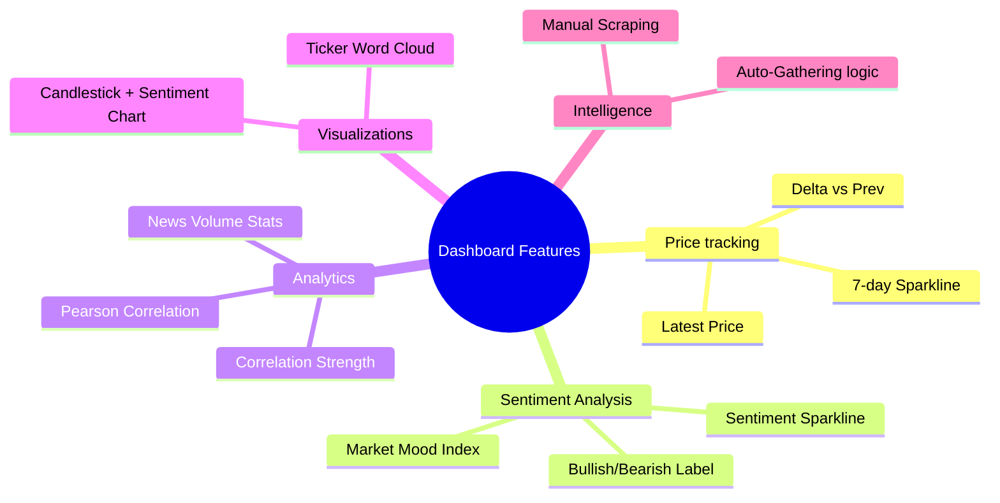
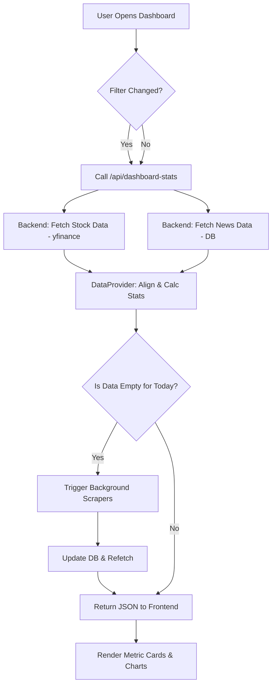
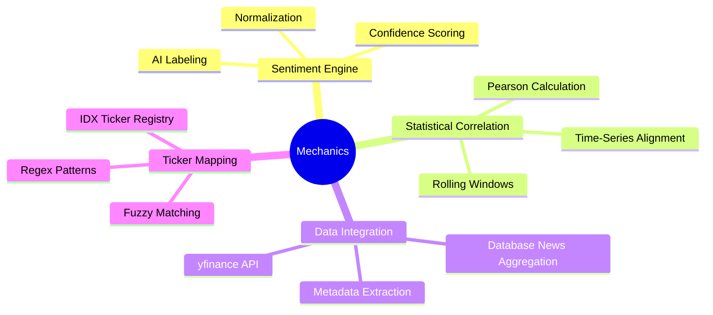
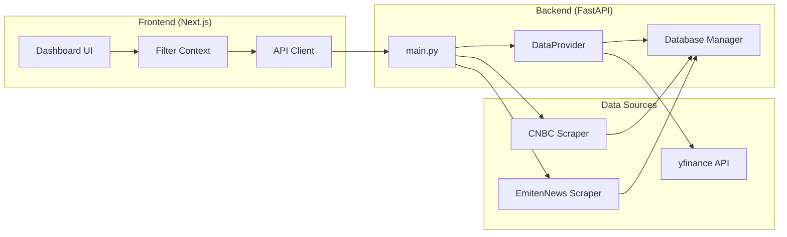
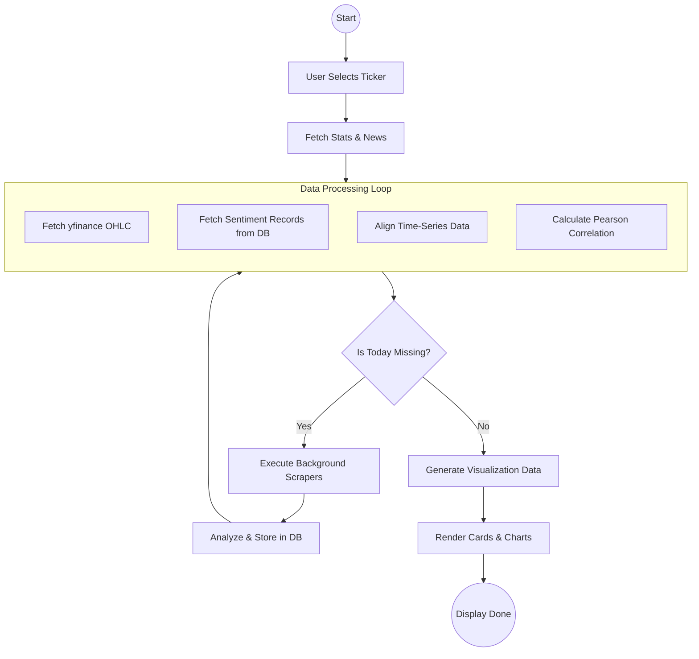

# Dashboard Market Intelligence Documentation

Dokumentasi ini menjelaskan fitur, alur kerja, cara kerja, dan arsitektur dari halaman **Market Intelligence Dashboard**.

---

## 1. Fitur Utama

- **Real-time Metrics Card**: Menampilkan metrik kunci dengan tren visual (sparkline).
    - **Latest Price**: Harga terakhir emiten atau indeks (perubahan harga & grafik tren 7 hari).
    - **Market Mood**: Indeks sentimen pasar (Bullish, Bearish, atau Netral).
    - **Correlation (Pearson)**: Mengukur hubungan linier antara pergerakan harga dan sentimen berita.
    - **News Volume**: Total volume berita yang dianalisis dalam periode tertentu.
- **Sentiment & Price Correlation Chart**: Grafik interaktif yang menggabungkan pergerakan harga (Candlestick) dengan rata-rata sentimen harian (Bar Chart) dan Moving Average-nya.
- **Trending Ticker Cloud**: Visualisasi emiten yang paling banyak dibicarakan berdasarkan volume berita terbaru.
- **Intelligent Refresh System**:
    - **Refresh Intelligence**: Tombol manual untuk memicu scraping berita terbaru.
    - **Auto-Gathering**: Secara otomatis memicu background scraping jika data hari ini belum tersedia.

---

## 2. Alur Kerja (Flow)

Alur dimulai dari interaksi pengguna di frontend hingga pemrosesan data di backend.

1.  **Inisialisasi**: Pengguna membuka dashboard atau mengubah filter (Ticker/Date Range).
2.  **Request**: Frontend mengirimkan permintaan ke API Endpoint `/api/dashboard-stats`.
3.  **Data Fetching**: 
    - Backend mengambil data harga dari Yahoo Finance (`yfinance`).
    - Backend mengambil data berita dari Database (SQLite/PostgreSQL).
4.  **Processing**: `DataProvider` menyelaraskan timestamp harga dan sentimen, lalu menghitung korelasi dan statistik lainnya.
5.  **Intelligence Check**: Jika volume berita hari ini = 0, sistem memicu scraping otomatis ke CNBC Indonesia dan EmitenNews.
6.  **Rendering**: Frontend menerima data JSON dan merender metrik serta grafik menggunakan Recharts.

---

## 3. Cara Kerja (Mechanics)

### Analisis Sentimen
Setiap berita yang di-scrape diproses oleh `SentimentEngine` (AI Model). Model memberikan label:
- **Bullish**: Dampak positif (skor 0-1).
- **Bearish**: Dampak negatif (skor 0 to -1).
- **Netral**: Tidak ada dampak signifikan (skor 0).

### Perhitungan Korelasi
Sistem menggunakan **Koefisien Korelasi Pearson**:
- Nilai dekat **1.0**: Harga cenderung naik saat sentimen positif (Strong Positive).
- Nilai dekat **-1.0**: Harga cenderung turun saat sentimen positif (Strong Negative/Inverse).
- Nilai dekat **0**: Tidak ada hubungan linier antara harga dan berita.

### Ticker Extraction
Menggunakan logika NER (Named Entity Recognition) untuk mendeteksi kode emiten (misal: BBCA, ASII) dari judul berita, sehingga berita dapat dikategorikan secara otomatis meskipun tidak disebutkan secara eksplisit oleh sumber berita.

---

## 4. Arsitektur

Sistem ini didasarkan pada arsitektur **Modern Web Application** dengan pemisahan tugas yang jelas.

- **Frontend (Next.js)**: 
    - State management menggunakan Context API (`FilterContext`).
    - Visualisasi menggunakan `Recharts` dan `Lucide Icons`.
- **Backend (FastAPI)**:
    - `main.py`: Entry point API.
    - `data_provider.py`: Core logic untuk agregasi data dan perhitungan statistik.
    - `modules/database.py`: layer komunikasi database.
- **External Services**:
    - **yfinance**: Sumber data market history.
    - **Web Scrapers**: Modul untuk mengambil berita dari CNBC & EmitenNews.

---

## 5. Keseluruhan Alur (End-to-End Flow)

Berikut adalah visualisasi menyeluruh dari siklus hidup data di dalam dashboard:

