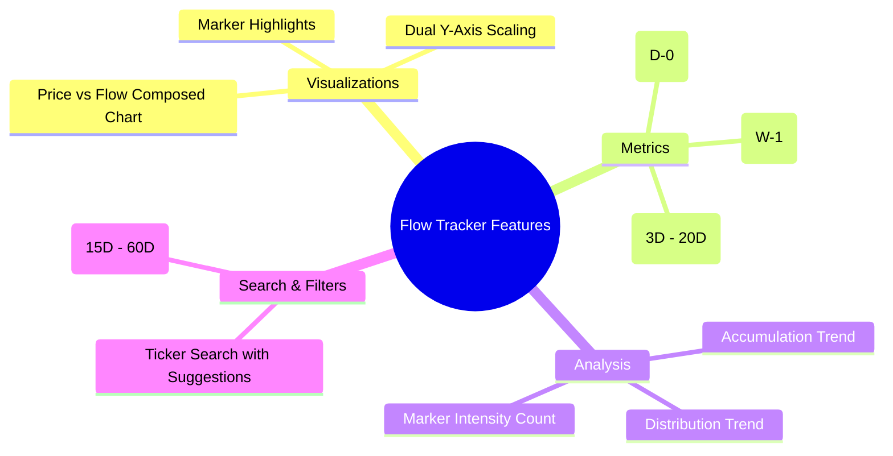
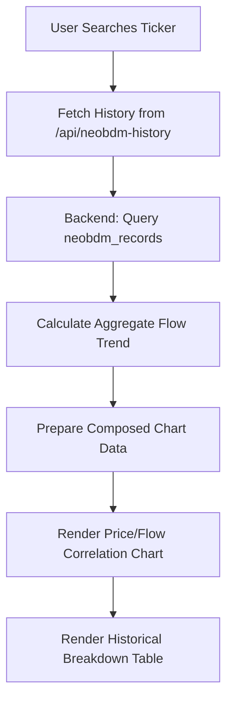
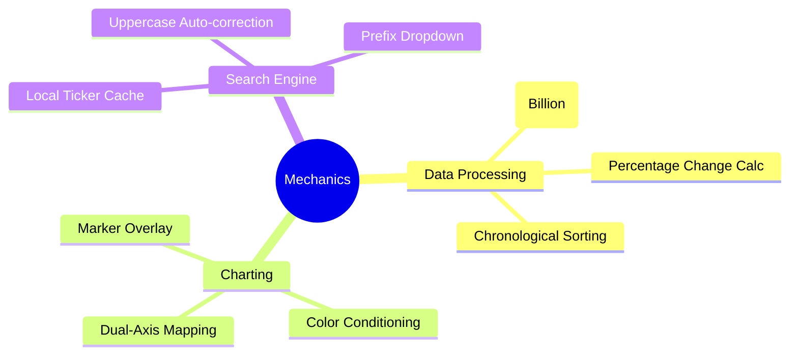
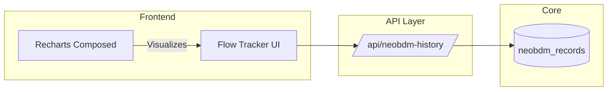
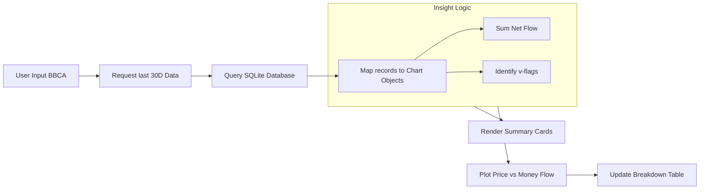

# NeoBDM - Flow Tracker Documentation

Dokumentasi ini menjelaskan fitur, alur kerja, cara kerja, dan arsitektur dari modul **Flow Tracker (Historical Money Flow)**.

---

## 1. Fitur Utama

- **Historical Money Flow Chart**: Grafik *composed* yang menggabungkan:
    - **Price Line**: Pergerakan harga saham (garis biru tebal).
    - **Money Flow Bars**: Volume akumulasi (hijau) atau distribusi (merah) dalam satuan Miliar (B).
- **Correlation Insight**: Membantu memvisualisasikan korelasi antara pergerakan harga dan aliran dana bandar.
- **Marker Detection**: Titik-titik indikator pada grafik harga yang menandai kejadian luar biasa:
    - **Pink Circle**: Indikasi akumulasi intens.
    - **Pulse Animation**: Visualisasi dinamis untuk menarik perhatian pada titik krusial.
- **Metric Selector**: Pilihan durasi aliran dana (D-0, W-1, C-3 hingga C-20) untuk melihat trend jangka pendek maupun panjang.
- **Historical Breakdown Table**: Tabel detail per hari yang mencakup harga, persentase perubahan, nilai flow, dan status marker.

---

## 2. Alur Kerja (Flow)

Alur dimulai dari pemilihan emiten untuk melihat histori aliran dananya.

1.  **Ticker Search**: Pengguna mencari kode emiten (misal: BBCA, ASII).
2.  **History Request**: Frontend memanggil `/api/neobdm-history` dengan parameter ticker, metode, dan limit waktu.
3.  **Data Processing**: Backend mengambil data histori dari tabel `neobdm_records` dan mengurutkannya secara kronologis.
4.  **Trend Analysis**: Sistem menghitung total akumulasi/distribusi dalam periode yang dipilih untuk menentukan status "ACCUMULATING" atau "DISTRIBUTING".
5.  **Synchronization**: Jika data histori kurang, user dapat melakukan sinkronisasi dari halaman Market Summary untuk mengisi database.

---

## 3. Cara Kerja (Mechanics)

### Composed Chart Logic
Menggunakan `Recharts` dengan `ComposedChart` untuk menampilkan dua tipe data yang berbeda dimensinya (Harga vs Volume Flow) dalam satu sumbu X (Waktu).
- **Left Y-Axis**: Skala harga (IDR).
- **Right Y-Axis**: Skala volume (Miliar IDR).

### Marker Integration
Logika marker (`Crossing`, `Unusual`, `Pinky`) diekstrak dari tabel database. Jika salah satu bernilai 'v', maka sebuah `ReferenceDot` atau kustom dot akan dirender di atas garis harga pada tanggal tersebut.

### Net Flow Trend Calculation
Menghitung jumlah seluruh `activeFlow` dalam periode yang ditampilkan. Jika hasil > 0, indikator status berubah menjadi hijau (Accumulating), memberikan kesimpulan cepat bagi investor.

---

## 4. Arsitektur

Modul ini adalah layer visualisasi historis di atas data Market Summary.

- **Component**: `NeoBDMTrackerPage`.
- **Backend Service**: `api.getNeoBDMHistory`.
- **Storage**: Bergantung sepenuhnya pada tabel `neobdm_records` yang diisi oleh Scraper.

---

## 5. Keseluruhan Alur (End-to-End Flow)

