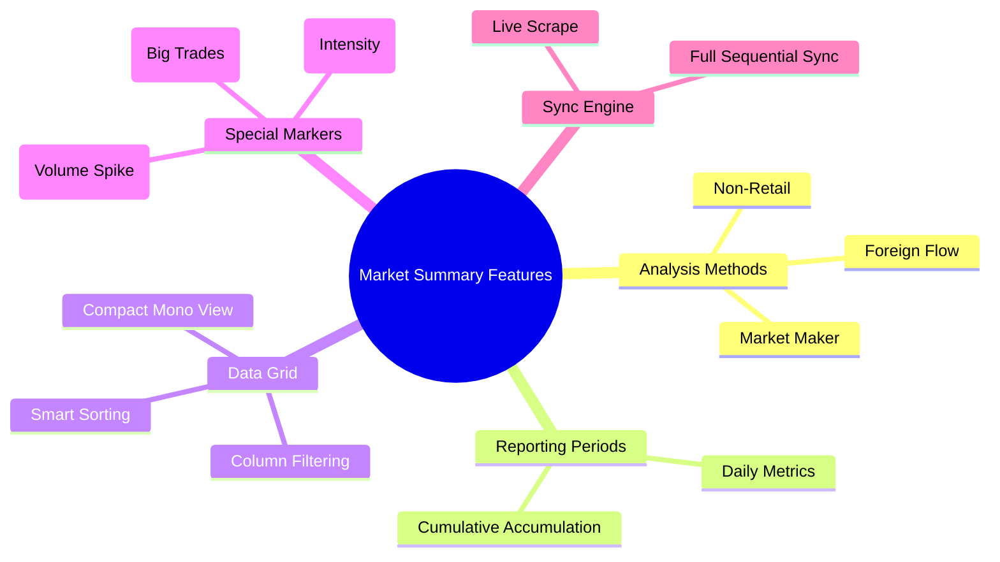
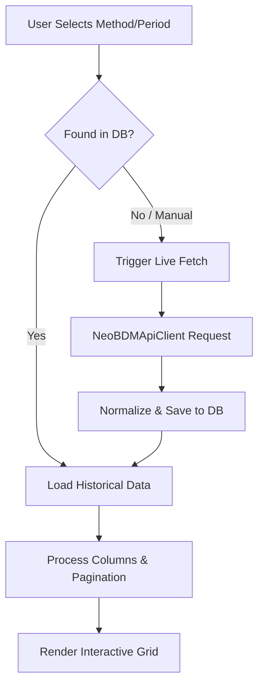
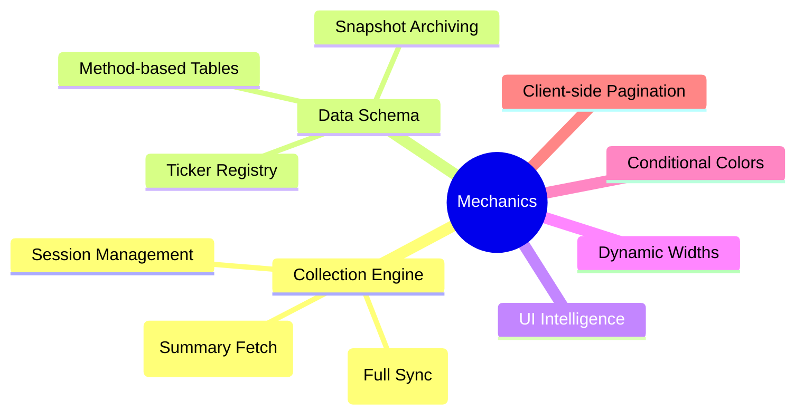
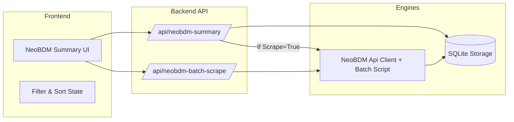
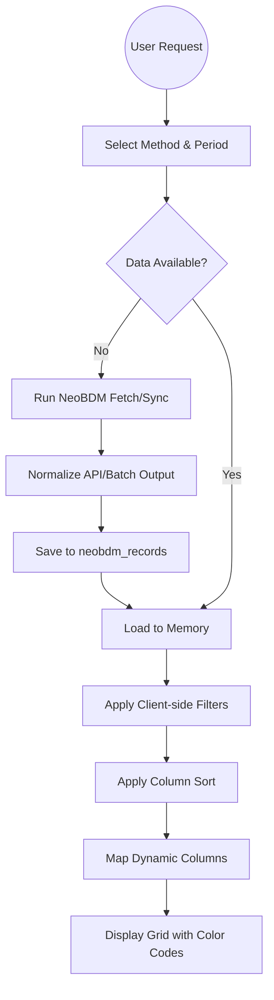

# NeoBDM - Market Summary Documentation

Dokumentasi ini menjelaskan fitur, alur kerja, cara kerja, dan arsitektur dari modul **Market Summary (NeoBDM Analysis)**.

---

## 1. Fitur Utama

- **Multi-Method Analysis**: Mendukung tiga metode analisa aliran dana:
    - **Market Maker Analysis**: Melacak aktivitas bandar/market maker.
    - **Non-Retail Flow**: Melacak pergerakan modal dari institusi/non-retail.
    - **Foreign Flow Analysis**: Melacak arus modal asing.
- **Dual Period Views**:
    - **Daily**: Data pergerakan harian terbaru.
    - **Cumulative**: Data akumulasi dalam rentang waktu tertentu.
- **Advanced Data Table**:
    - Ultra-compact view dengan font mono untuk densitas data maksimum.
    - Sorting cerdas (numerik & string) pada setiap kolom.
    - Filter per-kolom untuk pencarian emiten atau kriteria teknikal secara instan.
- **Marker Highlighting**: Deteksi otomatis sinyal khusus seperti **Crossing**, **Unusual**, dan **Pinky** (indikasi akumulasi intens).
- **Batch Sync & Live Scrape**: Kemampuan untuk mengambil data terbaru secara langsung atau melakukan sinkronisasi penuh untuk semua metode dan periode.

---

## 2. Alur Kerja (Flow)

Alur dimulai dari pemilihan metode analisa hingga penyajian data mendalam.

1.  **Configuration**: User memilih Metode (m/nr/f) dan Periode (d/c).
2.  **Date Selection**: User memilih tanggal data dari histori yang tersedia di database.
3.  **Data Fetching**: 
    - Frontend memanggil `/api/neobdm-summary`.
    - Jika `scrape=true`, backend memanggil `NeoBDMApiClient` untuk mengambil data terbaru lalu menyimpan snapshot ke database.
    - Jika `scrape=false`, backend mengambil record terbaru dari SQLite.
4.  **Processing & UI Mapping**: Backend memetakan kolom dinamis berdasarkan periode (misal: kolom `w-1` di daily vs `c-5` di cumulative).
5.  **Rendering**: Data disajikan dalam tabel dengan pewarnaan kondisional (hijau untuk akumulasi, merah untuk distribusi).

---

## 3. Cara Kerja (Mechanics)

### API Client + Batch Sync
Pengambilan data harian dilakukan via `NeoBDMApiClient` untuk endpoint ringkas. Untuk sinkronisasi penuh, endpoint `/api/neobdm-batch-scrape` menjalankan script batch terpisah (subprocess) agar kompatibel dengan batasan event loop Playwright di Windows.

### Dynamic Column Ordering
Tabel secara otomatis menyesuaikan kolom yang ditampilkan berdasarkan periode yang dipilih:
- **Daily Mode**: Fokus pada `w-4` s/d `d-0` (perubahan harian).
- **Cumulative Mode**: Fokus pada `c-20` s/d `c-3` (akumulasi jangka menengah).
- **Technical Metrics**: Selalu menyertakan perbandingan harga terhadap MA5 s/d MA100.

### Conditional Formatting Logic
- **`v` markers**: Dikonversi menjadi badge berwarna (Pink/Orange) pada kolom Pinky/Crossing.
- **Negative Values**: Otomatis berwarna merah (Distribusi).
- **Positive Values**: Otomatis berwarna hijau (Akumulasi).

---

## 4. Arsitektur

Modul ini berfungsi sebagai komponen *data-heavy* yang berinteraksi intens dengan database.

- **Component**: `NeoBDMSummaryPage`.
- **Backend API**: 
    - `/api/neobdm-summary`: Endpoint utama data.
    - `/api/neobdm-dates`: Mengambil daftar histori tanggal.
    - `/api/neobdm-batch-scrape`: Memicu sinkronisasi masif.
- **Database**: Tabel `neobdm_records` menyimpan snapshot data mentah per tanggal dan metode.

---

## 5. Keseluruhan Alur (End-to-End Flow)

