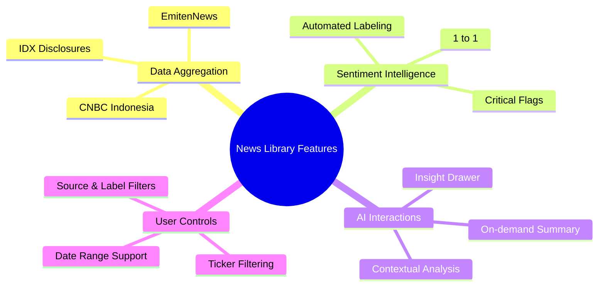
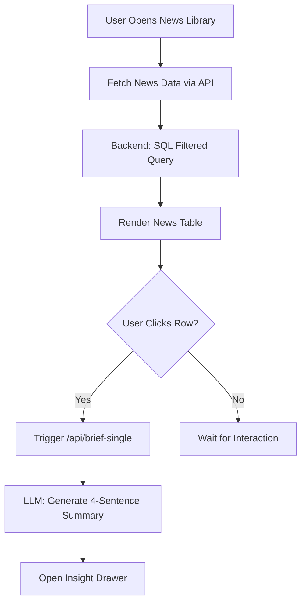
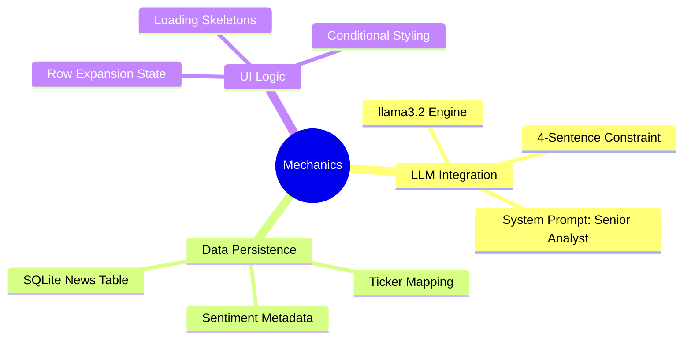
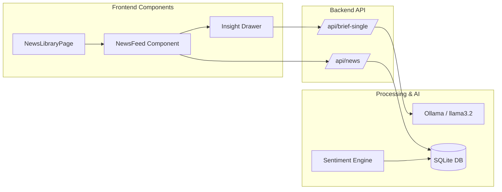
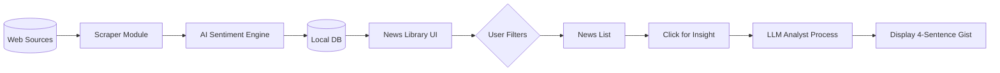

# News Library & Disclosure Documentation

Dokumentasi ini menjelaskan fitur, alur kerja, cara kerja, dan arsitektur dari modul **News & Disclosures Library**.

---

## 1. Fitur Utama

- **Unified News Feed**: Menggabungkan berita dari berbagai sumber (CNBC, EmitenNews) dan keterbukaan informasi (IDX) dalam satu tabel terintegrasi.
- **Sentiment Labeling**: Setiap artikel diberi label **Bullish**, **Bearish**, atau **Netral** beserta skor numerik presisi.
- **AI Insight Drawer (The "Gist")**:
    - Fitur ekspansi baris menggunakan `Sparkles` icon.
    - Menghasilkan rangkuman 1 paragraf (4 kalimat) yang mencakup inti kejadian, latar belakang, dampak, dan prospek investor secara *on-demand*.
- **Critical Insight Highlighter**: Menandai artikel dengan skor sentimen ekstrim (di atas 0.8 atau di bawah -0.8) sebagai "Critical Insight".
- **Dynamic Filtering**:
    - Filter berdasarkan Ticker (terintegrasi dengan Global Filter).
    - Filter lokal berdasarkan Sumber (Source) dan kategori Sentimen.

---

## 2. Alur Kerja (Flow)

Alur kerja modul ini berfokus pada penyajian data historis dan analisis AI instan.

1.  **Request Service**: Frontend memanggil `/api/news` dengan parameter filter (ticker, date, sentiment, source).
2.  **DB Query**: Backend (`DatabaseManager`) melakukan query ke tabel `news` dan `disclosures` dengan filter SQL yang dioptimasi.
3.  **Data Rendering**: Frontend merender data ke dalam `NewsFeed` component.
4.  **Insight Generation**: 
    - Pengguna mengklik ikon `Sparkles` atau baris tabel.
    - Frontend memanggil `/api/brief-single` dengan judul berita sebagai konteks.
    - LLM (llama3.2) memproses judul dan ticker untuk menghasilkan insight strategis.
5.  **Direct Link**: Pengguna dapat mengklik "VIEW" untuk langsung menuju URL sumber berita asli.

---

## 3. Cara Kerja (Mechanics)

### On-Demand Summarization
Berbeda dengan dashboard yang menyajikan data agregat, News Library menggunakan **Lazy Loading** untuk insight AI. Insight hanya dibuat saat baris diklik untuk menghemat latensi dan sumber daya komputasi LLM.

### Scoring Logic
- **Score > 0.5**: Bullish (Sentimen positif kuat).
- **Score < -0.5**: Bearish (Sentimen negatif kuat).
- **Score 0**: Netral.
- **Score >= 0.8**: Ditandai sebagai **Critical Insight** dengan border biru khusus pada UI.

### Crawler Sync
Data perpustakaan ini diperbarui secara berkala melalui background task atau manual refresh dari Dashboard, yang kemudian disimpan secara permanen di SQLite untuk akses cepat.

---

## 4. Arsitektur

Modul ini menggunakan pola **Master-Detail** dalam penyajian datanya.

- **Component Hierarchy**: `NewsLibraryPage` (Container) -> `NewsFeed` (Table) -> `InsightDrawer` (Sub-row).
- **Backend Services**:
    - `modules/scraper_*.py`: Bertanggung jawab mengisi database.
    - `modules/database.py`: Menangani filter kompleks (ticker, date, sentiment).
    - `main.py`: Mengekspos endpoint `/api/news` dan `/api/brief-single`.

---

## 5. Keseluruhan Alur (End-to-End Flow)

Berikut adalah visualisasi bagaimana sebuah berita masuk ke perpustakaan hingga dianalisa oleh pengguna:

