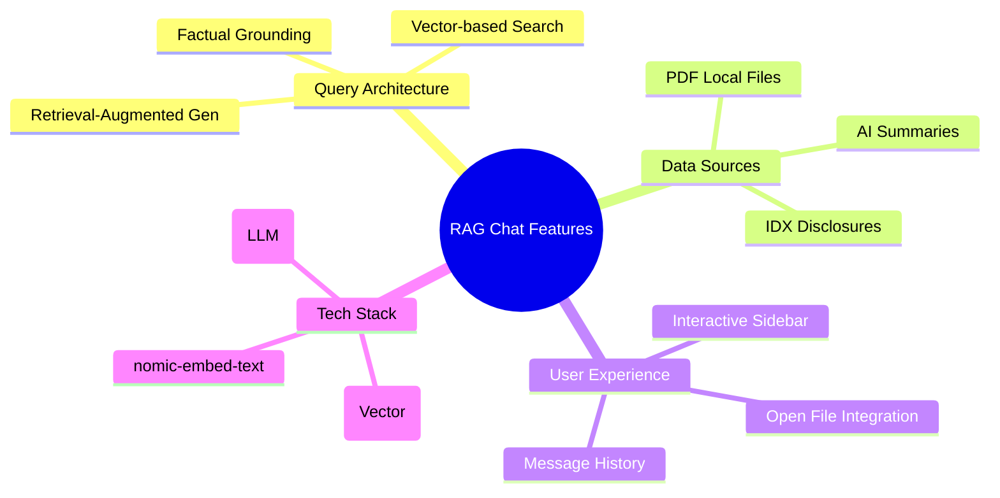
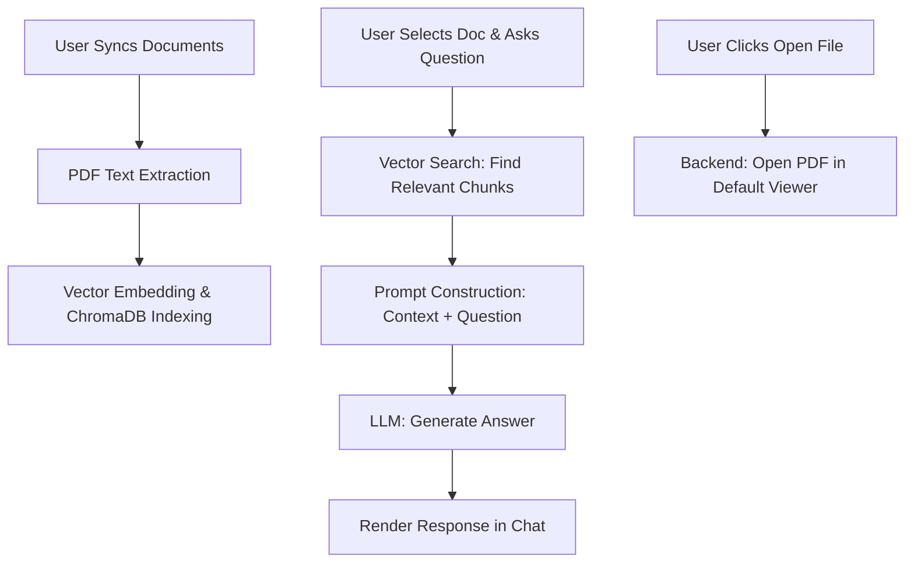
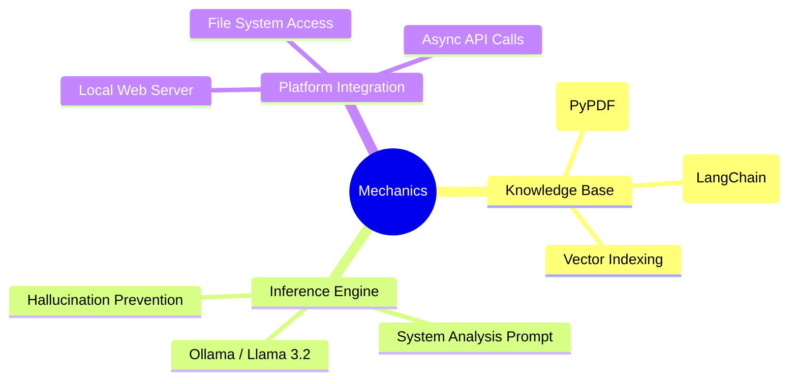
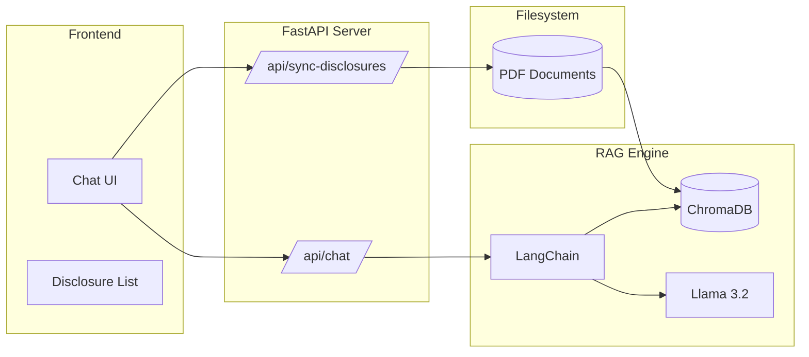
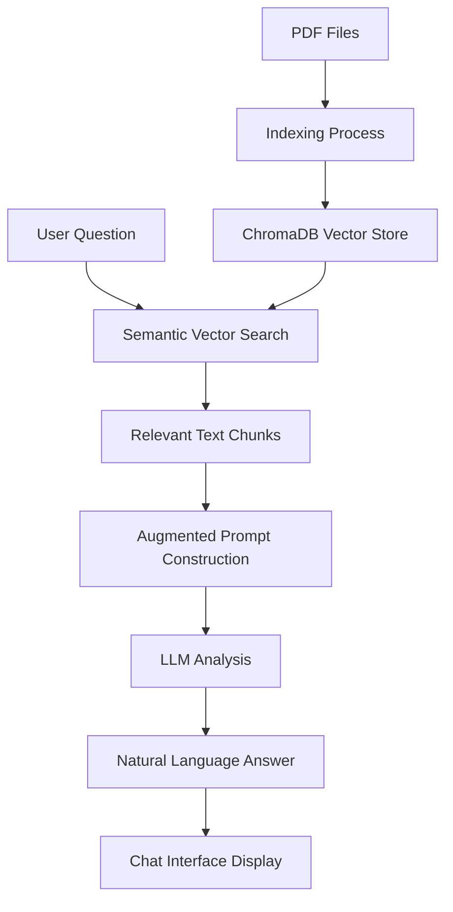

# Intelligence Agent - RAG Chat Documentation

Dokumentasi ini menjelaskan fitur, alur kerja, cara kerja, dan arsitektur dari modul **Intelligence Agent (RAG Chat)**.

---

## 1. Fitur Utama

- **Document-Based Conversation**: Chatbot cerdas yang dapat menjawab pertanyaan spesifik berdasarkan dokumen Keterbukaan Informasi (IDX).
- **RAG (Retrieval-Augmented Generation)**: Jawaban didasarkan pada data faktual dari dokumen yang dipilih, bukan hanya pengetahuan umum AI.
- **Local File Integration**: Kemampuan untuk membuka file PDF secara lokal langsung dari interface chat melalui sistem integrasi OS.
- **AI Summary Preview**: Menampilkan rangkuman otomatis buatan AI untuk setiap dokumen di panel pilihan sumber.
- **Contextual Memory**: Mempertahankan konteks pembicaraan per dokumen untuk tanya-jawab yang mendalam.

---

## 2. Alur Kerja (Flow)

Alur kerja melibatkan proses indexing dokumen dan interaksi chat.

1.  **Sync & Index**: User memicu "Synchronize", sistem memindai folder `downloads`, mengekstrak teks PDF, dan memasukkannya ke Vector Database.
2.  **Document Selection**: User memilih dokumen emiten dari sidebar kiri.
3.  **User Inquiry**: User mengirimkan pertanyaan (misal: "Berapa dividen yang dibagikan?").
4.  **Retrieval**: Sistem mencari potongan teks paling relevan dari dokumen tersebut menggunakan *Embeddings*.
5.  **Generation**: LLM memproses potongan teks tersebut untuk menyusun jawaban komprehensif.
6.  **Response**: Jawaban ditampilkan di interface chat.

---

## 3. Cara Kerja (Mechanics)

### Retrieval-Augmented Generation (RAG)
Sistem tidak melatih ulang model AI. Sebaliknya, ia menyisipkan bagian relevan dari dokumen ke dalam "bisikan" (prompt) kepada AI, sehingga AI berbicara dengan dasar data asli dokumen.

### Vector Database (ChromaDB)
Menggunakan `nomic-embed-text` untuk mengubah teks menjadi koordinat numerik (vektor). Hal ini memungkinkan pencarian berbasis makna (Semantik), bukan hanya kata kunci.

### PDF-to-Process
Modul `idx_processor.py` menangani konversi PDF yang diunduh dari IDX menjadi data terstruktur yang siap dianalisa oleh agen kecerdasan.

---

## 4. Arsitektur

RAG Chat adalah perpaduan antara data engineering dan AI generatif.

- **Component**: `RagChatInterface`.
- **Backend API**: `/api/chat`, `/api/sync-disclosures`, `/api/open-file`.
- **AI Stack**:
    - **Model**: Llama 3.2 (Local via Ollama).
    - **Embeddings**: Nomic Embeddings.
    - **Vector Store**: ChromaDB.

---

## 5. Keseluruhan Alur (End-to-End Flow)

