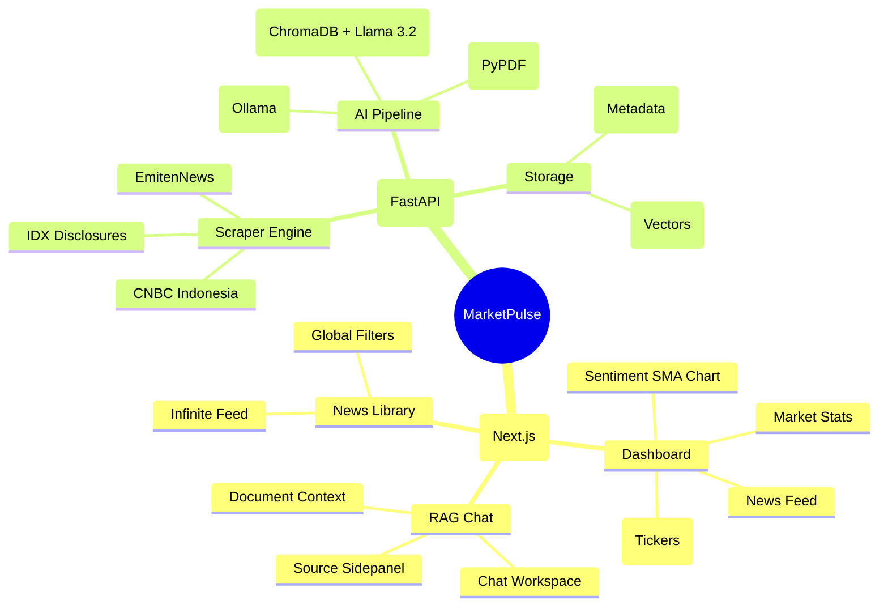
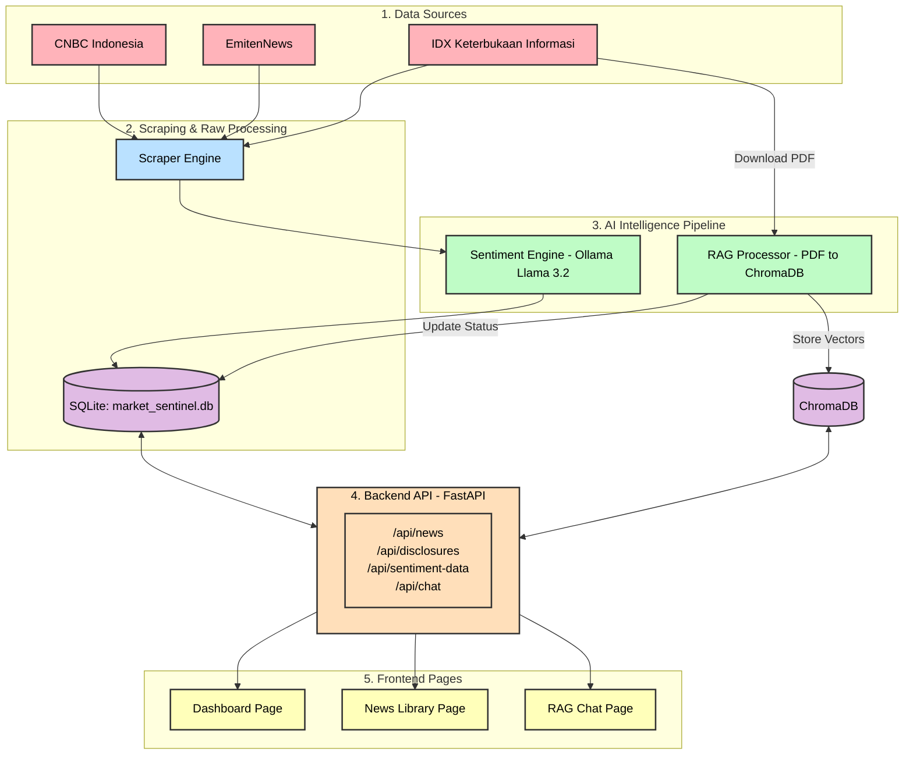

# Visual Mindmap & Data Flow

Dokumen ini menjelaskan alur kerja data di dalam aplikasi `MarketPulse`, mulai dari pengambilan data (scraping) hingga ditampilkan kepada pengguna.

## 1. High-Level Mindmap
Mindmap ini menunjukkan struktur utama aplikasi dan bagaimana fitur-fiturnya terhubung.

---

## 2. Detailed Data Flow
Alur kerja data dari scraping hingga muncul di halaman aplikasi.

---

## 3. Penjelasan Alur Tiap Fitur

### A. Dashboard & News Feed
1.  **Scraping**: User memicu scraping via `ScraperControl.tsx` -> API `/api/scrape`.
2.  **Analysis**: Backend menjalankan `modules/scraper_cnbc.py` atau `modules/scraper_emiten.py`. Data dianalisis sentimennya secara real-time menggunakan Ollama.
3.  **Storage**: Berita + Label Sentimen disimpan di SQLite.
4.  **Display**: Halaman Dashboard & News Library memanggil `/api/news` atau `/api/sentiment-data` untuk menampilkan chart dan daftar berita terbaru.

### B. Keterbukaan Informasi (RAG)
1.  **Scraping**: User memicu scraping IDX -> PDF diunduh ke folder `downloads/`.
2.  **Indexing**: `idx_processor.py` membaca PDF, memecahnya menjadi potongan kecil (chunks), dan menyimpannya di **ChromaDB** bersama embedding dari Ollama (Nomic).
3.  **Summary**: AI membuat ringkasan singkat 1 kalimat untuk tampilan tabel.
4.  **Chat**: Saat user bertanya di tab RAG Chat, API `/api/chat` mengambil konteks relevan dari ChromaDB (hanya untuk dokumen tersebut) dan menjawabnya menggunakan Llama 3.2.
